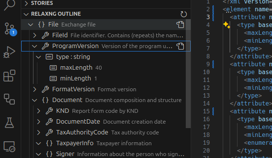

# RelaxNG Outline

This Visual Studio Code extension provides an outline view for RelaxNG documents. Please note that RelaxNG support is partial, and this is an alpha version of the plugin.

## Features
- Displays an outline for RelaxNG files.
- Allows navigation to specific nodes in the RelaxNG document.
- Provides commands to copy node paths.
- Enables navigation to the corresponding node in the outline based on the cursor position.
- Includes optional synchronization of cursor position and selection in the outline.

## Installation
1. Open the Extensions view in Visual Studio Code.
2. Search for "RelaxNG outline".
3. Click "Install".

## Usage
1. Open a RelaxNG file in Visual Studio Code.
2. The outline view will automatically display the structure of the RelaxNG document.
3. Use the synchronization feature to keep the outline selection and cursor position in sync.

## Known Issues
- Partial support for RelaxNG syntax.
- This is an alpha version, so expect some bugs and incomplete features.

## Contributing
Contributions are welcome! Please submit issues and pull requests on the [GitHub repository](https://github.com/tihonove/vscode-relaxng-outline).

## License
This extension is licensed under the MIT License.
